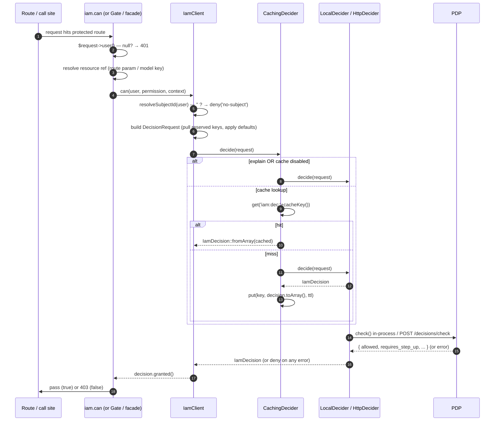

# Decision pipeline

This page traces *one* decision from the moment your app asks to the moment it acts, naming every step in
order. It's the runtime companion to the [architecture overview](/architecture/overview).

## End-to-end sequence

## Step by step

::: steps
1. **Entry & authentication gate**
   For a route, `iam.can` first checks `$request->user()`; a null user aborts **401** before any PDP work.
   The Gate adapter and facade are entered with a user/subject already in hand.

2. **Resource resolution (middleware only)**
   With `iam.can:perm,routeParam`, the middleware reads `$request->route(routeParam)` and reduces an Eloquent
   model to `(string) getKey()`, or uses a scalar route value directly. The reference goes into
   `context['resource']`.

3. **Subject resolution**
   `IamClient::resolveSubjectId()` maps the user to a string id (`getAuthIdentifier()` for an
   `Authenticatable`, the string itself for a string, `''` for null). An empty id short-circuits to
   `deny('no-subject')`.

4. **Request building**
   `IamClient::request()` pulls the [reserved keys](/concepts/context-and-resources)
   (`organization`, `application`, `resource`, `aal`, `explain`) out of the context, applies config defaults,
   and constructs the immutable `DecisionRequest`. The remaining context is ABAC facts.

5. **Cache decorator**
   `CachingDecider` bypasses entirely when `explain` is set, caching is disabled, or `ttl <= 0`. Otherwise it
   looks up `'iam:dec:' + cacheKey()`; a hit rehydrates via `fromArray()`, a miss delegates and stores
   `toArray()` for `ttl` seconds.

6. **Transport**
   `LocalDecider` calls `AuthorizationEngine::check($request->toArray())` in-process; `HttpDecider` POSTs the
   same array to `{base}/decisions/check` and unwraps the `{data}` envelope. Either way, any failure becomes a
   `deny(...)`.

7. **Outcome**
   The caller evaluates `granted()` (= `allowed && !requiresStepUp`). Middleware turns `false` into **403**;
   the Gate adapter returns `false` (short-circuiting the gate); the facade returns the boolean or the full
   decision.
:::

## Where each failure exits

| Step | Failure | Result |
|---|---|---|
| 1 | no authenticated user (middleware) | 401 |
| 3 | unresolvable subject | `deny('no-subject')` |
| 6 (local) | engine throws | `deny('engine: …')` |
| 6 (http) | non-2xx / bad body / transport throw | `deny('http …' / 'invalid body' / 'transport: …')` |
| 7 | `granted()` is false | 403 / `false` |

Every non-happy exit is a denial — the [fail-closed](/concepts/fail-closed) invariant, visible end to end.

## Determinism & idempotency

Steps 3–6 are pure functions of the inputs: same inputs → same `cacheKey()` → same decision (until grants
change). That's what makes step 5's caching safe and what lets a retried request reuse a cached answer. See
[Cache decisions](/guides/cache-decisions).

## See also

- [Architecture overview](/architecture/overview)
- [The decision contract](/concepts/decision-contract)
- [Transports](/architecture/transports)
