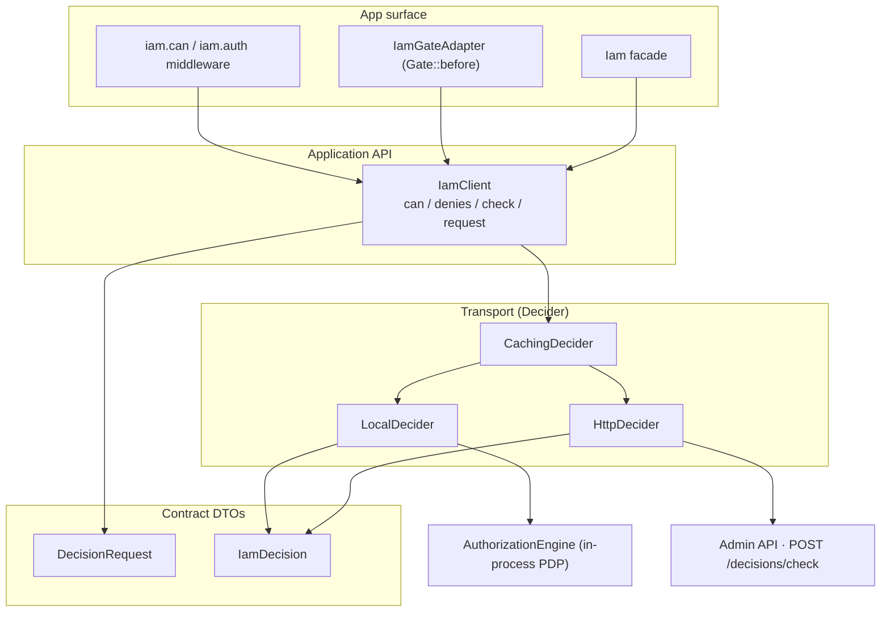
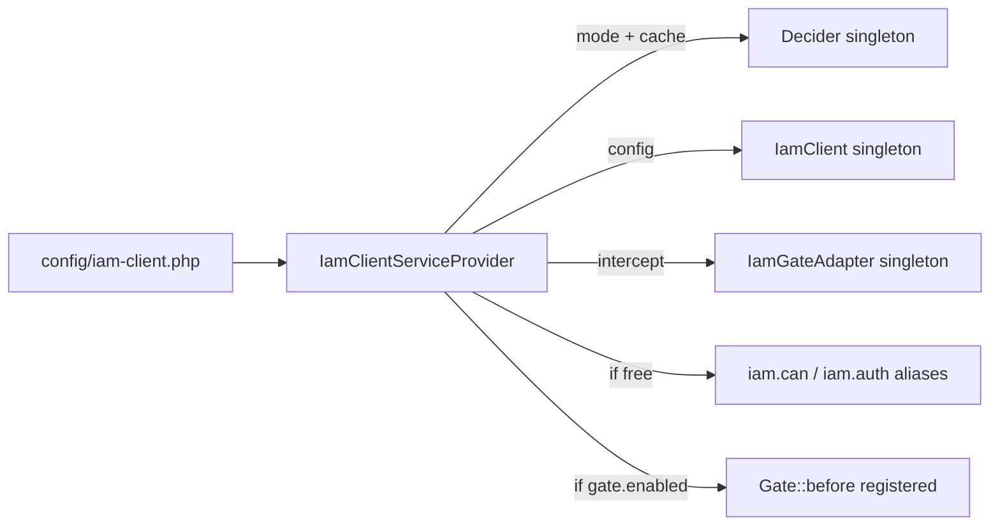

# Architecture overview

## The shape of the package

`laravel-iam-client` is deliberately small and layered. Each layer has one job and depends only on the layer
below it.

## Components

| Component | Namespace | Role |
|---|---|---|
| `IamClient` | `Padosoft\Iam\Client` | Application API; builds a `DecisionRequest`, returns an `IamDecision`. |
| `Iam` facade | `…\Client\Facades` | Static sugar over `IamClient`. |
| `DecisionRequest` | `…\Client` | Immutable query DTO; `toArray()` + `cacheKey()`. |
| `IamDecision` | `…\Client` | Immutable outcome DTO; `granted()`, `fromArray()`, `toArray()`. |
| `Decider` | `…\Client\Contracts` | Transport interface: `decide(DecisionRequest): IamDecision`. |
| `LocalDecider` / `HttpDecider` / `CachingDecider` | `…\Client\Deciders` | In-process / remote / caching transports. |
| `IamGateAdapter` | `…\Client\Gate` | Registers `Gate::before`. |
| `IamAuthenticate` / `IamCan` | `…\Client\Http\Middleware` | The `iam.auth` / `iam.can` aliases. |
| `IamClientServiceProvider` | `…\Client` | Wires it all together. |

## Wiring (the service provider)

`IamClientServiceProvider` extends `spatie/laravel-package-tools`' `PackageServiceProvider`.

- **`packageRegistered()`** binds three singletons: `Decider` (mode + cache), `IamClient` (config),
  `IamGateAdapter` (intercept).
- **`packageBooted()`** aliases the middleware *if free*, and registers the Gate adapter when
  `gate.enabled`.

## Design properties

- **Transport-agnostic application code.** The surface (middleware, Gate, facade) depends on `IamClient`,
  which depends on the `Decider` *interface* — never a concrete transport. Swapping `local` ↔ `http` is a
  config change. See [Transports](/architecture/transports).
- **Immutable DTOs.** `DecisionRequest` and `IamDecision` are `final readonly`, so a decision can't be
  mutated after the PDP returns it, and a request can't drift between building and sending.
- **Fail-closed at every layer.** Subject resolution, transport, and response parsing each default to deny.
  See [Fail-closed authorization](/concepts/fail-closed).
- **Non-invasive coexistence.** The Gate adapter intercepts only namespaced abilities by default, and the
  middleware aliases yield to any already-registered `iam.can`. The client slots into an existing app
  without displacing its authorization.

## Dependencies

The package depends on [`padosoft/laravel-iam-contracts`](https://doc.laravel-iam-contracts.padosoft.com)
for the `AuthorizationEngine` interface (the `local` seam) and shared DTO conventions, and on
`guzzlehttp/guzzle` for the `http` transport. It does **not** depend on the server package at runtime in
`http` mode — only the contract.

## See also

- [Decision pipeline](/architecture/decision-pipeline) — a single request, end to end.
- [Transports (the Decider seam)](/architecture/transports)
- [Architecture decisions (ADR)](/architecture/decisions)
