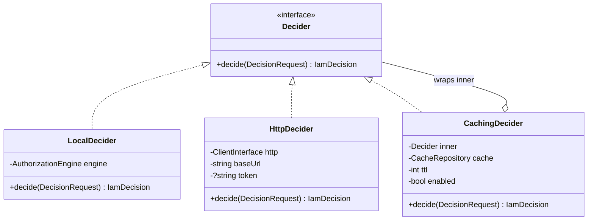

# Transports (the Decider seam)

## The interface

Every transport implements one method:

```php
interface Decider {
    public function decide(DecisionRequest $request): IamDecision;
}
```

This single seam is what makes the application code transport-agnostic. `IamClient` depends on `Decider`, not
on any concrete class, so the choice of transport — and whether caching is layered on — is purely a wiring
decision made by the [service provider](/architecture/overview).



## `LocalDecider` — in-process PDP

```php
new LocalDecider(AuthorizationEngine $engine);
```

Delegates straight to `AuthorizationEngine::check($request->toArray())` — no network. Used when the IAM
server lives in the same app (`mode=local`). Any throwable from the engine becomes
`deny('engine: ' . Throwable::class)`, mirroring the http transport's fail-closed behavior so an in-process
PDP error never leaks as an opaque 500.

This is the fastest and most reliable path: a function call, not a request.

## `HttpDecider` — remote Admin API

```php
new HttpDecider(ClientInterface $http, string $baseUrl, ?string $token);
```

`decide()`:

::: steps
1. **POST** `rtrim($baseUrl, '/') . '/decisions/check'` with
   - headers `Accept: application/json` and, if `$token !== null`, `Authorization: Bearer <token>`;
   - JSON body `$request->toArray()`;
   - `http_errors => false` so Guzzle never throws on a non-2xx.
2. **Status check** — anything outside 2xx → `deny("http {status}")`.
3. **Decode** — a non-array body → `deny('invalid body')`.
4. **Unwrap** — if the body has an array `data` key, read from it; else read the body flat (the
   [`{data}` envelope](/concepts/decision-contract)).
5. **Parse** — `IamDecision::fromArray($payload)`.
:::

Any throwable anywhere in that block → `deny('transport: ' . Throwable::class)`. No path returns an allow on
error.

::: callout info "http_errors => false is intentional" icon:info
Disabling Guzzle's exceptions lets the transport map a 401/403/500 from the server into a *clean* deny with a
diagnostic reason, instead of an exception that would also deny but with a noisier signature. Either way the
outcome is deny — this just makes the reason legible.
:::

## `CachingDecider` — the decorator

```php
new CachingDecider(Decider $inner, CacheRepository $cache, int $ttl, bool $enabled = true);
```

A transparent decorator: it *is* a `Decider` and *wraps* a `Decider`. It bypasses (delegating to `inner`)
when `!enabled`, `ttl <= 0`, or `request.explain`; otherwise it reads/writes
`'iam:dec:' . $request->cacheKey()`. Because it implements the same interface, `IamClient` can't tell whether
it's talking to a cache or a live PDP — the essence of the decorator pattern. See
[Cache decisions](/guides/cache-decisions).

## How the provider assembles them

```php
$base = mode === 'http' ? new HttpDecider(...) : new LocalDecider(...);
$decider = cache.enabled ? new CachingDecider($base, $store, ttl) : $base;
```

So the runtime object graph is at most two deep: a `CachingDecider` wrapping either a `LocalDecider` or an
`HttpDecider`.

## Writing your own transport

Because the seam is one method, a custom transport is straightforward — e.g. a gRPC client, a queue-backed
decider, or a test double:

```php
use Padosoft\Iam\Client\Contracts\Decider;
use Padosoft\Iam\Client\DecisionRequest;
use Padosoft\Iam\Client\IamDecision;

final class NullAllowDecider implements Decider // ⚠ tests only — never in production
{
    public function decide(DecisionRequest $request): IamDecision
    {
        return new IamDecision(allowed: true);
    }
}
```

Bind it over the contract in a service provider:

```php
$this->app->singleton(Decider::class, fn () => new NullAllowDecider());
```

::: callout danger "A custom transport owns the fail-closed contract"
The built-in transports guarantee *deny on error*. If you write your own, you are responsible for preserving
that: never return an allow on a failure, malformed response, or timeout. An always-allow decider like the one
above is for tests only.
:::

## See also

- [Choose a transport](/guides/choose-transport)
- [The decision contract](/concepts/decision-contract)
- [Fail-closed authorization](/concepts/fail-closed)
