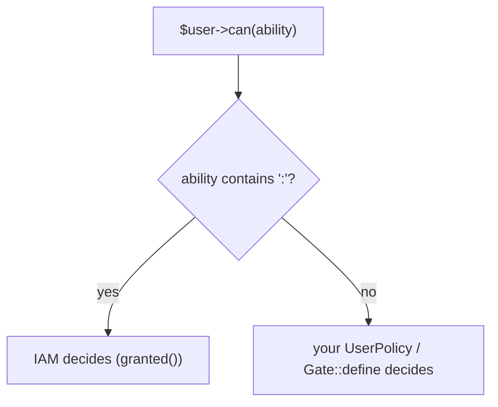

# Coexistence with local Gates

## Motivation

You rarely centralize all authorization in one big-bang change. The client is built so IAM and your existing
Laravel policies can run **side by side**, and you migrate one ability at a time without breaking the rest.

## The two coexistence mechanisms

| Mechanism | Default | Effect |
|---|---|---|
| Gate adapter `intercept` | `namespaced` | IAM owns only abilities containing `:`; the rest stay with local Gates/policies |
| Middleware alias guard | non-clobbering | `iam.can` / `iam.auth` register only if those names are free |

### Namespaced interception

With `gate.intercept = namespaced`, the adapter's `Gate::before` returns IAM's verdict for
`app:permission`-style abilities and `null` for everything else — so Laravel falls through to your existing
policy.



This is the key to gradual rollout: name centralized abilities with a namespace (`billing:invoices.update`),
and leave legacy abilities (`update-post`, `view-dashboard`) untouched until you're ready.

::: callout tip "Convention: namespace = centralized" icon:tag
Adopt the rule *"if it has a `:`, IAM owns it"*. It makes the boundary obvious in code review and lets you
move an ability into IAM simply by renaming it to a namespaced key (and declaring it in the server manifest).
:::

## Migrating an ability into IAM

::: steps
1. **Declare it on the server** — add the permission/role to the app's manifest so the PDP can decide it.
2. **Rename the ability to a namespaced key** — `edit-invoice` → `billing:invoices.update`. The Gate adapter
   now routes it to IAM automatically.
3. **Remove the local policy method** — once the PDP is authoritative, delete the now-dead
   `InvoicePolicy::update()` (or leave it; `namespaced` interception means it won't be consulted for the
   namespaced ability anyway).
4. **Verify** — `Iam::check($user, 'billing:invoices.update', ['explain' => true])` should explain the
   decision via central policy.
:::

## Avoiding alias collisions

In a **same-app** deployment that also runs the IAM server, the server already defines `iam.can` for its
Admin API. The client's provider won't overwrite it. When you specifically want the *client* middleware on an
app route, reference the class:

```php
use Padosoft\Iam\Client\Http\Middleware\IamCan;

Route::put('/invoices/{invoice}', [InvoiceController::class, 'update'])
    ->middleware(['auth', IamCan::class.':billing:invoices.update,invoice']);
```

In a **consumer-only** app (only `-client` installed), `iam.can` is unambiguously yours — the string alias is
fine.

## Turning the adapter off

Set `gate.enabled = false` to leave Laravel's Gate completely untouched — for example during
[spatie bridge shadow mode](/best-practices/migrating-from-spatie), where the adapter's enforcement would
corrupt decision diffing. You can still enforce explicitly via the `iam.can` middleware on the routes you've
already cut over.

## Gotchas

::: callout warning "intercept: all replaces every policy"
`gate.intercept = all` sends *every* ability to IAM, including non-namespaced ones your local policies still
own. Only flip to `all` once every ability is declared on the server — otherwise unmigrated abilities will be
denied (the PDP doesn't know them). Keep `namespaced` during migration.
:::

::: callout danger "Don't centralize an ability before declaring it"
Renaming an ability to a namespaced key routes it to IAM *immediately*. If the server's manifest doesn't yet
declare it, the PDP denies it. Declare first, rename second.
:::

## See also

- [Use the Gate adapter](/guides/gate-adapter)
- [Migrating from spatie/permission](/best-practices/migrating-from-spatie)
- [Protect routes with iam.can](/guides/protect-routes)
