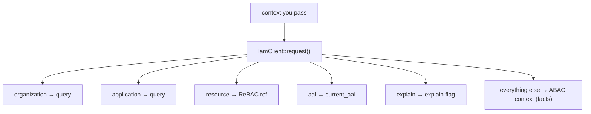

# ABAC context & ReBAC resources

## The three authorization models, from the client's seat

The PDP combines three models; the client's job is to carry the right inputs for each:

| Model | Question | Client carries |
|---|---|---|
| **RBAC** | Does the subject have a role granting this permission? | subject + permission |
| **ABAC** | Do the *attributes* of this request satisfy the policy condition? | the `context` facts |
| **ReBAC** | Is the subject in the right *relationship* to this resource? | the `resource` reference |

A single query can exercise all three at once — e.g. *"role billing:operator (RBAC), on invoice inv_1001
(ReBAC), for an amount ≤ 1000 (ABAC)"*.

## The reserved-key split

`IamClient::request()` takes the flat `$context` you pass and splits it. A fixed set of **reserved keys** is
*pulled out* (and removed) to populate query fields; **whatever remains** is forwarded verbatim as ABAC
`context`.



| Reserved key | Becomes | Default |
|---|---|---|
| `organization` | `DecisionRequest::$organization` | `default_organization` config |
| `application` | `DecisionRequest::$application` | `default_application` config |
| `resource` | `DecisionRequest::$resource` | `null` |
| `aal` | `DecisionRequest::$currentAal` | `aal1` |
| `explain` | `DecisionRequest::$explain` | `false` |

A reserved value is only used if it's a non-empty string (for the string keys); otherwise the default
applies. `aal` falls back to `aal1` when empty.

## Worked split

```php
Iam::check($user, 'warehouse:stock.adjust', [
    'organization' => 'org_acme',   // reserved → query.organization
    'resource'     => 'wh_milan',   // reserved → query.resource (ReBAC)
    'aal'          => 'aal2',        // reserved → query.current_aal
    'amount'       => 300,           // ABAC fact
    'shift'        => 'night',       // ABAC fact
]);
```

produces the request body:

```json
{
  "subject": { "type": "user", "id": "42" },
  "permission": "warehouse:stock.adjust",
  "organization": "org_acme",
  "application": "warehouse",
  "resource": "wh_milan",
  "context": { "amount": 300, "shift": "night" },
  "current_aal": "aal2",
  "explain": false
}
```

Note how `amount` and `shift` stayed in `context` while the reserved keys were lifted out.

## Resource references

The `resource` is a **string** reference the PDP understands — typically an entity id (`inv_1001`), a slug
(`wh_milan`), or a model key. The client never inspects its meaning; it just passes it through and includes
it in the [cache key](/guides/cache-decisions). The contract is between *your app* and *your PDP policy*: emit
the same reference format the policy expects.

How a resource gets set, by entry point:

- **Facade** — the reserved `'resource'` context key (a string you provide).
- **`iam.can` middleware** — the bound route value; an Eloquent model is reduced to `(string) getKey()`.
- **Gate adapter** — a **string** first argument only (models are not auto-keyed).

See [Per-resource (ReBAC) checks](/guides/rebac-resource-checks) for the practical guide.

## Defaults that keep call sites clean

Because `organization` and `application` fall back to `default_organization` / `default_application` (set via
`IAM_CLIENT_ORG` / `IAM_CLIENT_APP`), most call sites pass neither — they inherit the app's identity. Override
per-call only when one app legitimately queries across tenants or app namespaces.

## Gotchas

::: callout warning "Reserved keys are removed from ABAC context"
If your policy genuinely needs a fact literally named `resource`, `organization`, `application`, `aal` or
`explain`, it won't arrive as an ABAC fact — those names are reserved and lifted to query fields. Name ABAC
facts something else (e.g. `target_resource`).
:::

::: callout danger "Don't forget the resource on a per-resource permission"
Omitting `resource` makes a ReBAC check global. The PDP then answers "in general", which is usually broader
than intended. Always bind the resource for per-resource permissions.
:::

## See also

- [The decision contract](/concepts/decision-contract)
- [Per-resource (ReBAC) checks](/guides/rebac-resource-checks)
- [Ask IAM with the facade](/guides/facade-checks)
