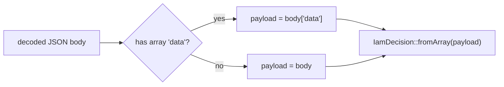

# The decision contract

This page is the precise data contract between the client, the cache, and the PDP. Everything here is what the
code actually emits and reads — use it when integrating, debugging, or writing a custom transport.

## `DecisionRequest`

The normalized query the client builds from `($user, $ability, $context)`.

```php
final readonly class DecisionRequest {
    public function __construct(
        public string  $permission,
        public string  $subjectId,
        public string  $subjectType = 'user',
        public ?string $organization = null,
        public ?string $application = null,
        public ?string $resource = null,
        public array   $context = [],       // ABAC facts
        public string  $currentAal = 'aal1',
        public bool    $explain = false,
    ) {}
}
```

### `toArray()` — the wire body

```json
{
  "subject":      { "type": "user", "id": "42" },
  "permission":   "billing:invoices.update",
  "organization": "org_acme",
  "application":  "billing",
  "resource":     "inv_1001",
  "context":      { "amount": 300 },
  "current_aal":  "aal1",
  "explain":      false
}
```

This same array is used two ways:

- **`local`** — passed to `AuthorizationEngine::check($array)` in-process.
- **`http`** — JSON body of `POST {base}/decisions/check`.

### `cacheKey()`

A SHA-256 over `subjectType, subjectId, permission, organization, application, resource, context, currentAal`
— every input that can change the verdict. (Note `explain` is *not* in the key, because explained requests
[bypass the cache](/guides/cache-decisions) entirely.)

## `IamDecision`

The normalized outcome.

```php
final readonly class IamDecision {
    public function __construct(
        public bool    $allowed,
        public string  $decisionId = '',
        public int     $policyVersion = 0,
        public bool    $requiresStepUp = false,
        public ?string $requiredAal = null,
        public array   $explanation = [],     // list<string>
    ) {}

    public static function deny(string $reason): self;
    public static function fromArray(array $data): self;
    public function granted(): bool;          // allowed && !requiresStepUp
    public function toArray(): array;
}
```

### `fromArray()` — reading the PDP response

`fromArray()` is defensive: every field is type-checked and falls back to a safe default. The expected
(snake_case) keys:

| Response key | Maps to | Fallback |
|---|---|---|
| `allowed` | `allowed` (`=== true`) | `false` |
| `decision_id` | `decisionId` | `''` |
| `policy_version` | `policyVersion` | `0` |
| `requires_step_up` | `requiresStepUp` (`=== true`) | `false` |
| `required_aal` | `requiredAal` | `null` |
| `explanation` | `explanation` (strings only) | `[]` |

Because `allowed` defaults to `false`, a malformed or partial response can never accidentally grant — it
decays to a deny. This is the [fail-closed](/concepts/fail-closed) property at the parsing layer.

### `toArray()` — what the cache stores

```json
{
  "allowed": true,
  "granted": false,
  "decision_id": "dec_abc",
  "policy_version": 7,
  "requires_step_up": true,
  "required_aal": "aal2",
  "explanation": ["role billing:operator grants invoices.update", "step-up required for delete"]
}
```

The [`CachingDecider`](/guides/cache-decisions) stores this array and rehydrates it with `fromArray()` on a
hit. (`granted` is included for readability; on rehydrate it's recomputed from `allowed` and
`requires_step_up`.)

## The `{ "data": ... }` envelope

The server's Admin API wraps every response in an envelope:

```json
{ "data": { "allowed": true, "requires_step_up": false, "decision_id": "dec_abc", "...": "..." } }
```

`HttpDecider` unwraps it transparently: if the decoded body has an array `data` key, it reads from there;
otherwise it reads the body as-is (so a flat body — e.g. a local PDP behind a proxy — still works). Without
this unwrap, `fromArray()` would read the wrong level and every decision would silently become a deny.



## Endpoint

::: callout info "The slash form is canonical" icon:link
The decision endpoint is `POST {base}/decisions/check` (slash). `base` is your versioned API root, e.g.
`https://iam.example.com/api/iam/v1`, so the full URL is `…/api/iam/v1/decisions/check`. The companion
list endpoint is `…/decisions/list-resources`.
:::

## See also

- [granted() vs allowed](/concepts/granted-vs-allowed)
- [ABAC context & ReBAC resources](/concepts/context-and-resources)
- [PHP API reference](/reference/php-api)
