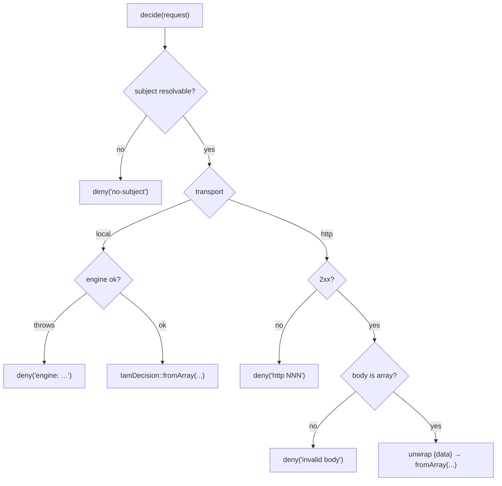

# Fail-closed authorization

## Motivation

An authorization client sits on the critical path of every protected action. The single most dangerous bug it
can have is to **allow** when it should have **denied** — an outage, a typo, a malformed response turning into
an open door. `laravel-iam-client` is built so that the *only* way an error resolves is **deny**.

## Definition

A decision function is **fail-closed** if, for every input and every failure mode, the result is a denial
unless the PDP explicitly and successfully returns a grant. Formally, let $E$ be the set of error events
(unreachable PDP, non-2xx status, unparseable body, engine exception, no subject). Then:

$$
\forall e \in E : \; \text{decide}(e) = \textsf{deny}
$$

There is no $e$ for which the client emits an allow. Equivalently, an allow is only ever produced by a
*successful* PDP response that says `allowed = true` (and clears [step-up](/concepts/granted-vs-allowed)).

## Every error path, enumerated

| Failure | Where | Result |
|---|---|---|
| No resolvable subject | `IamClient::check()` | `IamDecision::deny('no-subject')` |
| HTTP non-2xx | `HttpDecider` | `deny("http {status}")` |
| Response body isn't an array | `HttpDecider` | `deny('invalid body')` |
| Any transport throwable (timeout, DNS, TLS…) | `HttpDecider` | `deny('transport: ' . Throwable::class)` |
| In-process engine throws | `LocalDecider` | `deny('engine: ' . Throwable::class)` |

Notice that even the "happy" branches only produce an allow when the PDP *says so*: `fromArray()` reads
`allowed` as `=== true`, defaulting to `false` for any missing or non-boolean value.

## No fail-open switch — by design

There is deliberately **no** `fail_open` configuration key. The reasoning, as an ADR:

::: collapsible "ADR: no fail-open opt-out"
**Problem.** Operators under pressure during a PDP outage are tempted to "just let requests through". A
config flag that does this is a foot-gun: it converts a availability incident into a security incident, often
permanently (flags rarely get turned back off).

**Decision.** The transport layer is *always* fail-closed. Tolerating an outage is an **application-level**
decision made consciously and locally — e.g. degrade a feature, queue the action, read a previously-cached
permit, or show a maintenance page — never a transport default.

**Consequences.** A PDP outage denies actions until it recovers. This is the correct trade-off for an
authorization control plane: an unavailable PDP must not become an unbounded grant. Teams that need
availability for specific actions design for it explicitly (HA server, `local` mode, caching), with eyes
open.
:::

## Why this is the safe default

The property that matters is: *the easy thing and the safe thing are the same thing*. A developer who writes
`if (Iam::can($u, $perm)) { ... }` gets fail-closed behavior for free — they cannot accidentally opt into
fail-open, because the option doesn't exist. Security that depends on everyone remembering to do the careful
thing fails; security that makes the careless path safe succeeds.

::: callout tip "Caching preserves the property" icon:shield
The [decision cache](/guides/cache-decisions) only stores *computed* decisions. An error returns a `deny`,
and at most a `deny` is cached. There is no code path that caches an allow it didn't receive from the PDP.
:::

## Gotchas

::: callout warning "Plan for the denial, not around it"
Because an unreachable PDP denies, your availability planning belongs at the application/topology layer:
server HA, `local` mode where possible, and a sensible cache TTL. Don't try to "soften" the transport — there
's no lever for it, and that's the point.
:::

## See also

- [granted() vs allowed](/concepts/granted-vs-allowed)
- [Fail-closed by design](/best-practices/fail-closed-design) — operational practices.
- [Transports](/architecture/transports)
