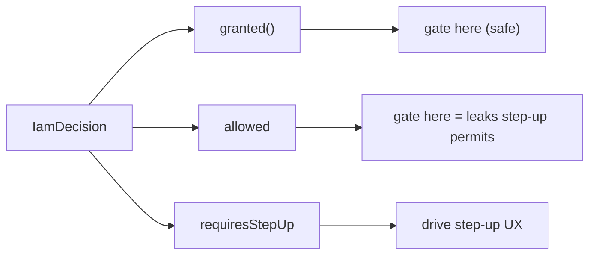

# `granted()` vs `allowed`

## The distinction in one line

`allowed` is what the **policy** says. `granted()` is what your **app should act on**. They differ exactly
when a permit is conditional on a higher assurance level.

## Why two notions exist

A modern PDP can return a *conditional* permit: *"this subject may delete invoices — but only from a session
at AAL2 or higher"*. Represented as a flat boolean, that nuance is lost; a naive gate on `allowed` would let a
weakly-authenticated session perform a sensitive action. So the decision carries the verdict **and** the
condition, and the client derives a single safe predicate:

$$
\text{granted}() \;=\; \text{allowed} \;\wedge\; \lnot\,\text{requiresStepUp}
$$

## Truth table

| `allowed` | `requiresStepUp` | `granted()` | Meaning |
|:---:|:---:|:---:|---|
| `false` | `false` | **false** | Denied outright. |
| `false` | `true` | **false** | Denied (step-up flag is moot). |
| `true` | `false` | **true** | Permitted now. |
| `true` | `true` | **false** | Permitted *only after* stepping up. Not yet. |

The only row where `allowed` and `granted()` disagree is the last — and it's precisely the row that matters
for security.

## What gates on what

| Caller | Uses |
|---|---|
| `iam.can` middleware | `granted()` (403 otherwise) |
| `IamGateAdapter` | `granted()` (returns `false`/`null`) |
| `Iam::can()` / `Iam::denies()` | `granted()` |
| **You**, handling a step-up UX | inspect `allowed` + `requiresStepUp` via `Iam::check()` |

So every *declarative* path is step-up-safe by construction. You only touch the raw fields when you
deliberately drive a [re-authentication flow](/guides/step-up).



## A worked contrast

```php
$d = Iam::check($user, 'billing:invoices.delete', ['aal' => 'aal1']);

// Suppose the PDP returns: allowed = true, requiresStepUp = true, requiredAal = 'aal2'
$d->allowed;        // true   ← the policy would permit
$d->requiresStepUp; // true   ← but not at aal1
$d->granted();      // false  ← so DO NOT proceed yet
```

If you had branched on `$d->allowed`, you'd have deleted the invoice from an `aal1` session — exactly the
mistake `granted()` exists to prevent.

## The rule

::: callout danger "Gate on granted(), never on allowed"
For any yes/no authorization decision, use `Iam::can()` or `->granted()`. Reach for `allowed` /
`requiresStepUp` *only* to decide whether to prompt for step-up — never to bypass it.
:::

## Other fields on the decision

`granted()` is the headline, but [`IamDecision`](/concepts/decision-contract) also exposes `requiredAal`
(the level to reach), `decisionId` and `policyVersion` (for audit correlation), and `explanation` (when you
asked to `explain`). Those are for diagnostics and UX, not for gating.

## See also

- [Handle step-up assurance](/guides/step-up)
- [The decision contract](/concepts/decision-contract)
- [Fail-closed authorization](/concepts/fail-closed)
