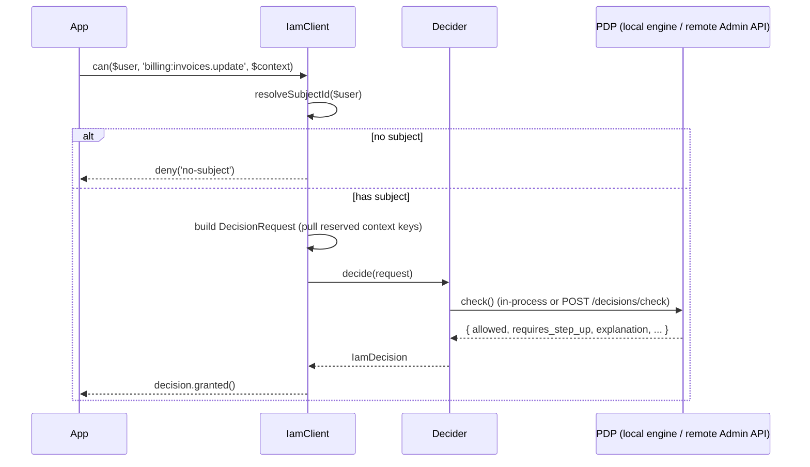
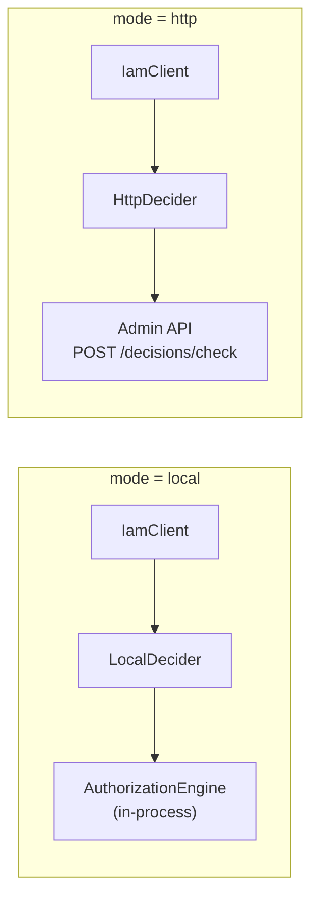

# Core concepts

If you read one conceptual page, read this one. It names the five moving parts and shows how a single
`$user->can()` call becomes a binding answer from the PDP.

## The five entities

| Entity | What it is |
|---|---|
| **`DecisionRequest`** | The normalized query: subject, permission, organization/application, optional resource, ABAC `context`, current AAL, and `explain`. Its `cacheKey()` hashes *all* of these. |
| **`Decider`** | The transport seam: `decide(DecisionRequest): IamDecision`. Three implementations — `LocalDecider`, `HttpDecider`, `CachingDecider`. Your app never knows which one runs. |
| **`IamDecision`** | The normalized outcome: `allowed`, `requiresStepUp`, `requiredAal`, `decisionId`, `policyVersion`, `explanation`. `granted()` combines `allowed` with the step-up state. |
| **`IamClient`** (and the **`Iam`** facade) | The application-facing API: `can()`, `denies()`, `check()`. Translates `($user, 'app:perm', $context)` into a `DecisionRequest`. |
| **`IamGateAdapter`** | Wires the client into Laravel's `Gate` via `Gate::before`, so existing `$user->can()` / `@can` / `authorize()` calls reach the PDP. |

## The decision flow



## Reserved context keys

`IamClient` separates **routing/metadata** from **ABAC facts**. When you call
`Iam::can($user, $ability, $context)`, these keys are *pulled out* of `$context` and mapped onto the query;
everything that remains is sent to the PDP as ABAC context.

| Reserved key | Maps to | Default |
|---|---|---|
| `organization` | `DecisionRequest::$organization` | `default_organization` config |
| `application` | `DecisionRequest::$application` | `default_application` config |
| `resource` | `DecisionRequest::$resource` (ReBAC) | `null` |
| `aal` | `DecisionRequest::$currentAal` | `aal1` |
| `explain` | `DecisionRequest::$explain` | `false` |

```php
Iam::check($user, 'warehouse:stock.adjust', [
    'organization' => 'org_acme',   // reserved → query
    'resource'     => 'wh_milan',   // reserved → ReBAC resource
    'aal'          => 'aal2',        // reserved → current assurance level
    'explain'      => true,          // reserved → ask for an explanation
    'amount'       => 300,           // NOT reserved → ABAC fact sent to the PDP
]);
```

See [ABAC context & ReBAC resources](/concepts/context-and-resources) for the full split.

## Fail-closed, everywhere

Every transport denies on *any* failure — an unreachable PDP, a non-2xx response, an unparseable body, or an
engine exception. There is **no fail-open opt-out**. On top of that, an unresolvable subject short-circuits to
`deny('no-subject')` before any transport is touched.

::: callout danger "The safe path is the default path"
You have to go out of your way to make this client insecure — the easy thing to do is also the safe thing.
Read [Fail-closed authorization](/concepts/fail-closed) for the formal argument.
:::

## `granted()` vs `allowed`

`allowed` is the raw PDP verdict. But a permit can carry `requiresStepUp = true`, meaning *"yes — but only at
a higher assurance level"*. Gating on `allowed` alone would let a low-AAL session through.

$$
\text{granted} \;=\; \text{allowed} \;\wedge\; \lnot\,\text{requiresStepUp}
$$

Middleware and the Gate adapter both gate on `granted()`. You only inspect `allowed` / `requiresStepUp`
yourself when you intend to *drive* a step-up flow. See [granted() vs allowed](/concepts/granted-vs-allowed).

## Two modes, one app code



The same controller, middleware and facade calls work in both modes. That's the whole point of the `Decider`
seam: a modular monolith can become distributed services without an application rewrite. See
[Choose a transport](/guides/choose-transport).

## Next

- [Protect routes with iam.can](/guides/protect-routes)
- [The decision contract](/concepts/decision-contract) — the exact request/response shapes.
- [Architecture overview](/architecture/overview) — how the parts fit.
