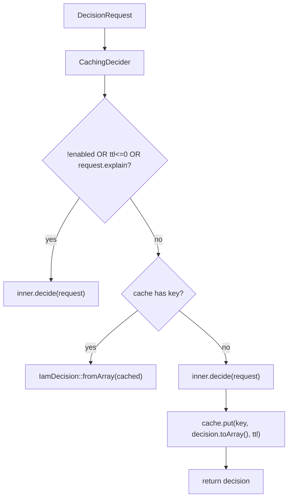

# Cache decisions

## Motivation

A PDP decision is **deterministic** for a given set of inputs: the same subject, permission, organization,
application, resource, ABAC context and AAL yield the same verdict — until the underlying grants change. That
makes decisions safely cacheable for a **short** window, which cuts round-trips in `http` mode and engine
work in `local` mode.

## The decorator

`CachingDecider` wraps the real transport. It's enabled by default and inserted by the service provider when
`iam-client.cache.enabled` is `true`.



The cache key is `'iam:dec:' . $request->cacheKey()`, where `cacheKey()` is a SHA-256 over **all** inputs:

```php
hash('sha256', json_encode([
    subjectType, subjectId, permission,
    organization, application, resource,
    context, currentAal,
]));
```

Because every input is in the key, two different queries can never collide on one cached answer — change the
AAL, the resource, or any ABAC fact and you get a different key.

## What is *not* cached

::: callout warning "explain is always fresh"
When `request.explain` is true, `CachingDecider` delegates straight to the inner transport and never reads or
writes the cache. Explanations must be current and aren't shareable across contexts. Don't expect cache hits
on `explain` checks.
:::

Also bypassed: when `cache.enabled` is false, or `cache.ttl <= 0`.

## Configuration

```php
// config/iam-client.php
'cache' => [
    'enabled' => true,   // wrap the transport in CachingDecider
    'ttl'     => 30,     // seconds
    'store'   => null,   // null = default cache store; or a named store
],
```

| Key | Default | Effect |
|---|---|---|
| `cache.enabled` | `true` | turn the decorator on/off |
| `cache.ttl` | `30` | seconds a decision is reused (`<= 0` disables caching even when enabled) |
| `cache.store` | `null` | which Laravel cache store to use (`null` = default) |

## Choosing a TTL

The TTL is a **staleness bound**: it's the longest a *revoked* grant can keep being honored, or a *newly
granted* one stay invisible, on this client.

- **Shorter** (e.g. 5–10s) → fresher decisions, more load on the PDP.
- **Longer** (e.g. 60s) → fewer round-trips, more staleness.

Pick the largest value your security posture tolerates. For most apps the 30s default is a good balance,
especially paired with `http` mode.

::: callout tip "Caching does not weaken fail-closed" icon:shield
The cache only ever stores *computed* decisions. A transport error never produces a cached allow — the inner
decider returns a `deny(...)`, and even that is only cached as a deny. An outage can't be "cached open".
:::

## Disabling

Set `cache.enabled = false` (or `cache.ttl = 0`) to always hit the live PDP. Useful when debugging policy
changes, or when your PDP is in-process (`local`) and already fast enough that caching adds little.

## Gotchas

::: callout danger "TTL is your revocation latency"
A user whose grant you revoke can still pass checks for up to `cache.ttl` seconds on each client. If you need
immediate revocation for a specific action, check it with `explain => true` (bypasses cache) or lower the TTL
for that deployment.
:::

::: callout warning "Pick a shared store for multi-node"
With multiple app servers, a per-process store gives each node its own cache. Use a shared store (Redis,
Memcached) via `cache.store` if you want consistent decision caching across the fleet.
:::

## See also

- [The decision contract](/concepts/decision-contract) — `toArray()` / `fromArray()`, the cached shape.
- [Choose a transport](/guides/choose-transport)
- [Configuration](/operations/configuration)
