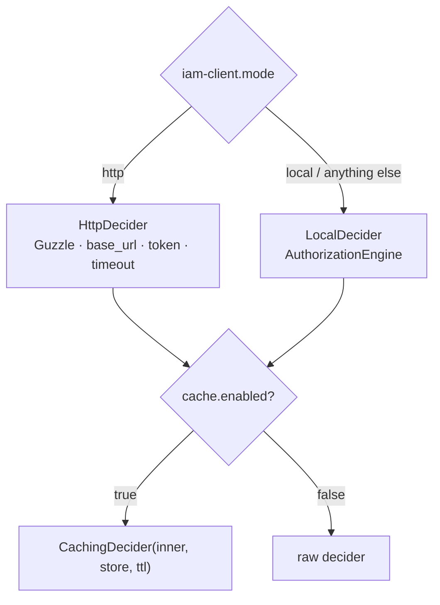

# Choose a transport

The client speaks to the PDP through a [`Decider`](/architecture/transports). Two concrete transports answer
the same `decide(DecisionRequest): IamDecision` contract, so your application code is identical either way.

## `local` vs `http` at a glance

| | `local` | `http` |
|---|---|---|
| Where the PDP runs | in the **same app** (in-process) | a **remote** IAM server |
| Mechanism | calls `AuthorizationEngine::check()` directly | `POST {base}/decisions/check` with a Bearer token |
| Network cost | none | one HTTP round-trip per uncached decision |
| Requires | the server package installed locally | a reachable server + service token |
| Typical use | modular monolith / same-repo deployment | distributed services |
| Failure mode | engine exception → **deny** | timeout / non-2xx / bad body → **deny** |

Both are **fail-closed**: see [Fail-closed authorization](/concepts/fail-closed).

## How the provider selects one

```php
// IamClientServiceProvider::makeDecider()
$base = mode === 'http'
    ? new HttpDecider(new GuzzleClient(['timeout' => http.timeout]), http.base_url, http.token)
    : new LocalDecider($app->make(AuthorizationEngine::class));

return cache.enabled ? new CachingDecider($base, $store, cache.ttl, true) : $base;
```

So `iam-client.mode` is the only switch between transports, and `iam-client.cache.enabled` decides whether
the result is wrapped in the cache decorator.



::: callout info "Local is the default"
`mode` defaults to `local`. Any value other than `http` selects the local transport — but set it explicitly
to `local` for clarity.
:::

## `local` setup

```dotenv
IAM_CLIENT_MODE=local
IAM_CLIENT_APP=billing
IAM_CLIENT_ORG=org_acme
```

Requires an `AuthorizationEngine` binding in the container — install the IAM server in the same app
([`padosoft/laravel-iam-server`](https://doc.laravel-iam-server.padosoft.com)). The client resolves it and
calls the PDP with no network hop, which is the fastest and most reliable path.

## `http` setup

```dotenv
IAM_CLIENT_MODE=http
IAM_CLIENT_BASE_URL=https://iam.example.com/api/iam/v1
IAM_CLIENT_TOKEN=your-service-bearer-token
IAM_CLIENT_APP=billing
IAM_CLIENT_ORG=org_acme
```

`HttpDecider` posts `DecisionRequest::toArray()` as JSON to `{base}/decisions/check`, sends
`Authorization: Bearer <token>` (omitted if the token is null), and disables Guzzle's HTTP exceptions
(`http_errors => false`) so it can map any non-2xx to a clean `deny("http {status}")` instead of throwing.

::: callout tip "The base URL already includes the API version" icon:link
Set `IAM_CLIENT_BASE_URL` to the versioned root, e.g. `https://iam.example.com/api/iam/v1`. The client
appends `/decisions/check` to it. The server wraps responses in `{ "data": {...} }`, which the client
unwraps transparently.
:::

## Switching monolith → services

Because the application code never references a transport, extracting the IAM server into its own service is
a configuration change:

::: steps
1. **Stand up the remote server** and mint a service token for this app.
2. **Flip the env**
   ```diff
   - IAM_CLIENT_MODE=local
   + IAM_CLIENT_MODE=http
   + IAM_CLIENT_BASE_URL=https://iam.example.com/api/iam/v1
   + IAM_CLIENT_TOKEN=${IAM_SERVICE_TOKEN}
   ```
3. **Clear config cache** (`php artisan config:clear`) and deploy. Routes, controllers, the Gate adapter and
   the facade are unchanged.
:::

See [Deployment topologies](/operations/deployment-topologies) for the bigger picture.

## Gotchas

::: callout warning "local mode needs the engine binding"
In `local` mode without an `AuthorizationEngine` in the container, building the decider fails — install the
server package in the same app, or use `http`.
:::

::: callout warning "Tune the http timeout deliberately"
`http.timeout` (default 5s) caps how long a decision can block a request. A too-long timeout turns a slow PDP
into slow pages; a too-short one turns transient latency into spurious denies. Pair `http` with the
[decision cache](/guides/cache-decisions).
:::
