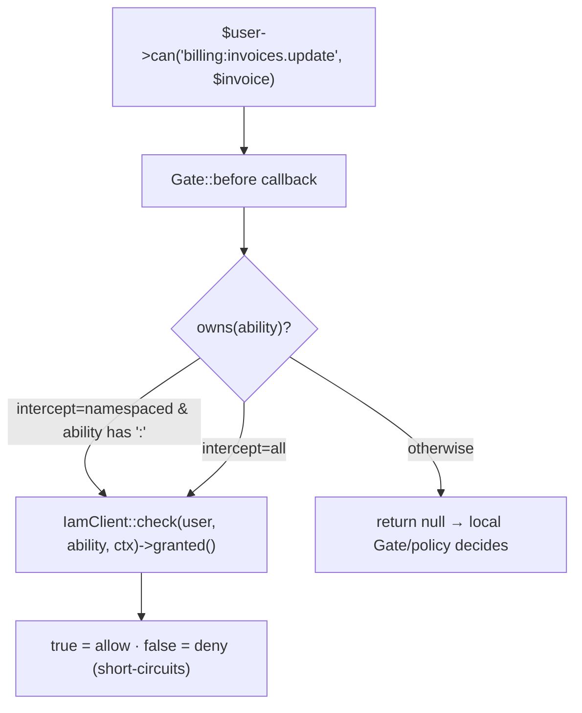

# Use the Gate adapter

## Motivation

Your app already calls `$user->can(...)`, `@can(...)` in Blade, and `$this->authorize(...)` in controllers.
The Gate adapter makes those calls reach the central PDP for the abilities that belong to IAM — so you
centralize policy without touching call sites.

## How it works

The adapter registers a single `Gate::before` callback. For each ability it decides whether it *owns* the
ability; if so it returns IAM's binding verdict, otherwise it returns `null` to let Laravel's local
Gates/policies decide.



`Gate::before` semantics: a non-null return **short-circuits** the gate. So when the adapter owns an ability,
its `true`/`false` is final; when it returns `null`, your existing policies run as usual.

## Enable / disable

It's registered automatically when `iam-client.gate.enabled` is `true` (the default). Set it to `false` to
leave Laravel's Gate untouched — for example while running the
[spatie migration bridge](/best-practices/migrating-from-spatie) in shadow mode, where the adapter's
enforcement would corrupt the decision diffing.

## Choosing what IAM owns: `intercept`

```php
// config/iam-client.php
'gate' => [
    'enabled'   => true,
    'intercept' => 'namespaced',  // or 'all'
],
```

| `intercept` | Owns | Leaves to Laravel |
|---|---|---|
| `namespaced` *(default)* | abilities containing `:` (e.g. `billing:invoices.update`) | everything else — your `UserPolicy`, `PostPolicy`, ad-hoc gates |
| `all` | every ability | nothing |

::: callout tip "Coexistence is the default" icon:layers
With `namespaced`, your local policies keep running for non-namespaced abilities like `update-post`. Only
`app:permission`-style abilities are centralized — which is exactly what you want during a gradual rollout.
:::

## Passing a resource

When you pass a **string** first argument to the gate, the adapter forwards it as the decision's `resource`:

```php
// 'wh_milan' becomes the ReBAC resource reference
$user->can('warehouse:stock.adjust', 'wh_milan');
```

If the first argument is not a non-empty string (e.g. an Eloquent model, an array, or nothing), no `resource`
is sent and the check is evaluated without a bound resource.

::: callout warning "Models aren't auto-keyed in the Gate path"
Unlike the [`iam.can` middleware](/guides/protect-routes) — which extracts a model's primary key — the Gate
adapter only uses a **string** first argument as the resource. If you want a model's id to scope the
decision, pass it explicitly:

```php
$user->can('billing:invoices.update', (string) $invoice->getKey());
```
:::

## Worked example

```php
// A controller — no IAM-specific code, just Laravel's authorize()
public function destroy(Invoice $invoice)
{
    $this->authorize('billing:invoices.delete', (string) $invoice->getKey());
    $invoice->delete();

    return back();
}
```

```blade
{{-- A Blade view --}}
@can('reports:view')
    <a href="/reports">Reports</a>
@endcan
```

Both reach the PDP because the abilities are namespaced. A plain `@can('edit-profile')` does not — it stays
with your local policy.

## Gotchas

::: callout danger "Don't rely on the Gate path for per-model scoping by default"
A bare `$user->can('billing:invoices.update', $invoice)` sends **no** resource (the model isn't a string), so
the PDP evaluates the permission globally. Pass `(string) $invoice->getKey()`, or enforce via
`iam.can:billing:invoices.update,invoice` at the route, where the key is extracted for you.
:::

## See also

- [Protect routes with iam.can](/guides/protect-routes)
- [granted() vs allowed](/concepts/granted-vs-allowed) — why the adapter gates on `granted()`.
- [Middleware & Gate reference](/reference/middleware-and-gate)
