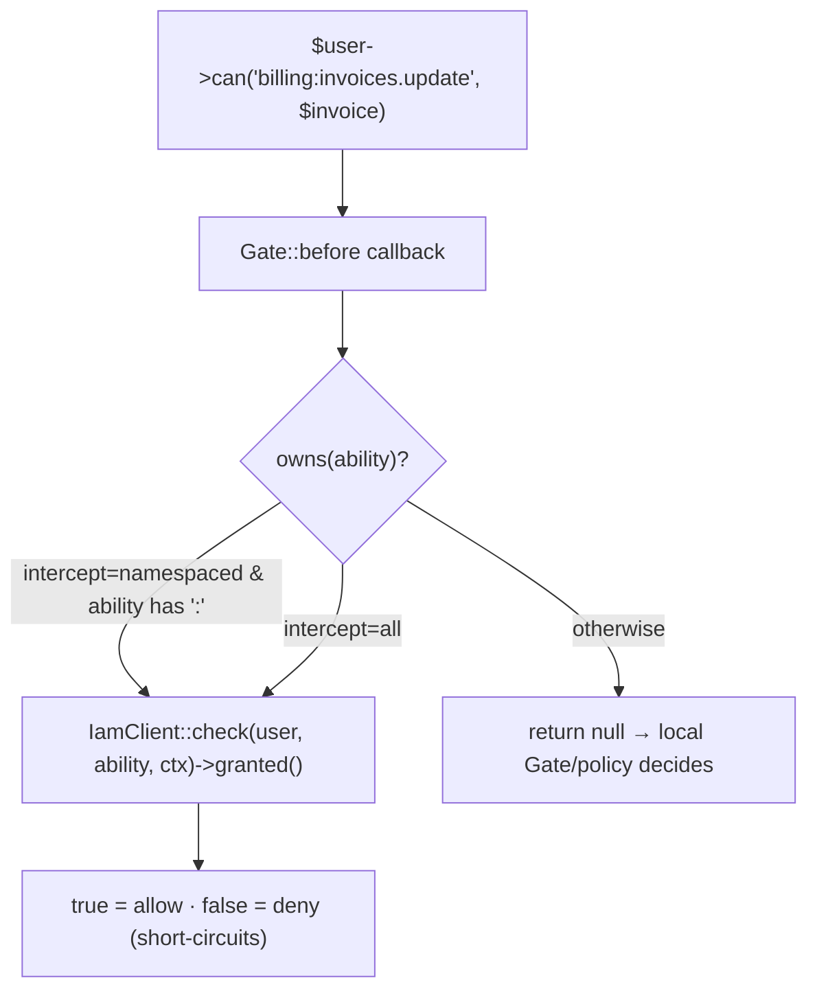

# Use the Gate adapter

## Motivation

Your app already calls `$user->can(...)`, `@can(...)` in Blade, and `$this->authorize(...)` in controllers.
The Gate adapter makes those calls reach the central PDP for the abilities that belong to IAM — so you
centralize policy without touching call sites.

## How it works

The adapter registers a single `Gate::before` callback. For each ability it decides whether it *owns* the
ability; if so it returns IAM's binding verdict, otherwise it returns `null` to let Laravel's local
Gates/policies decide.


```mermaid
flowchart TD
    CAN["$user->can('billing:invoices.update', $invoice)"] --> BEFORE["Gate::before callback"]
    BEFORE --> OWN{"owns(ability)?"}
    OWN -->|"intercept=namespaced & ability has ':'"| YES["IamClient::check(user, ability, ctx)->granted()"]
    OWN -->|"intercept=all"| YES
    OWN -->|"otherwise"| NULL["return null → local Gate/policy decides"]
    YES --> RESULT["true = allow · false = deny (short-circuits)"]
```

`Gate::before` semantics: a non-null return **short-circuits** the gate. So when the adapter owns an ability,
its `true`/`false` is final; when it returns `null`, your existing policies run as usual.

## Enable / disable

It's registered automatically when `iam-client.gate.enabled` is `true` (the default). Set it to `false` to
leave Laravel's Gate untouched — for example while running the
[spatie migration bridge](/best-practices/migrating-from-spatie) in shadow mode, where the adapter's
enforcement would corrupt the decision diffing.

## Choosing what IAM owns: `intercept`

```php
// config/iam-client.php
'gate' => [
    'enabled'   => true,
    'intercept' => 'namespaced',  // or 'all'
],
```

| `intercept` | Owns | Leaves to Laravel |
|---|---|---|
| `namespaced` *(default)* | abilities containing `:` (e.g. `billing:invoices.update`) | everything else — your `UserPolicy`, `PostPolicy`, ad-hoc gates |
| `all` | every ability | nothing |

::: callout tip "Coexistence is the default" icon:layers
With `namespaced`, your local policies keep running for non-namespaced abilities like `update-post`. Only
`app:permission`-style abilities are centralized — which is exactly what you want during a gradual rollout.
:::

### Scope to your apps: `app_keys` (IAM-40)

`namespaced` still owns **every** `app:permission` ability — including one from an *unrelated* package (say a
logging tool's `log:viewer`). IAM doesn't know that permission, so it would deny it and override the local
Gate. List the app prefixes IAM actually owns to fence this off:

```php
'gate' => [
    'intercept' => 'namespaced',
    'app_keys'  => ['warehouse', 'billing'],   // env: IAM_CLIENT_APP_KEYS=warehouse,billing
],
```

Now the adapter owns `warehouse:*` and `billing:*` and returns `null` for any other namespaced ability, so
`log:viewer` falls through to the local Gate. Empty `app_keys` (the default) keeps the historic behavior:
all namespaced abilities are IAM's.

## Passing a resource

The first gate argument becomes the decision's `resource`. **IAM-24**: the adapter resolves both a scalar and
an **Eloquent model** — a model is keyed to `(string) $model->getKey()`, exactly as the
[`iam.can` middleware](/guides/protect-routes) does, so a per-resource check on the Gate path is never
silently widened into a global one:

```php
$user->can('warehouse:stock.adjust', 'wh_milan');   // scalar → resource 'wh_milan'
$user->can('billing:invoices.update', $invoice);      // model  → resource (string) $invoice->getKey()
```

If the first argument is not a model and not a non-empty scalar — an array, `null`, or a scalar that casts to
an empty string (e.g. `false` or `''`) — no `resource` is sent and the check is evaluated without a bound
resource.

## Worked example

```php
// A controller — no IAM-specific code, just Laravel's authorize()
public function destroy(Invoice $invoice)
{
    // The model is keyed to its id automatically (IAM-24); passing (string) $invoice->getKey() also works.
    $this->authorize('billing:invoices.delete', $invoice);
    $invoice->delete();

    return back();
}
```

```blade
{{-- A Blade view --}}
@can('reports:view')
    <a href="/reports">Reports</a>
@endcan
```

Both reach the PDP because the abilities are namespaced. A plain `@can('edit-profile')` does not — it stays
with your local policy.

## Gotchas

::: callout warning "The resource is the model's primary key"
`$user->can('billing:invoices.update', $invoice)` scopes the decision to `(string) $invoice->getKey()`. If
your ReBAC tuples key the resource by something other than the primary key (a slug, a UUID column), pass that
value explicitly as a string instead of the model. A non-scalar key (or a non-scalar, non-model argument)
resolves to **no** resource, so the permission is evaluated globally — pass an explicit string when you need
per-resource scoping in that case.
:::

## See also

- [Protect routes with iam.can](/guides/protect-routes)
- [granted() vs allowed](/concepts/granted-vs-allowed) — why the adapter gates on `granted()`.
- [Middleware & Gate reference](/reference/middleware-and-gate)
