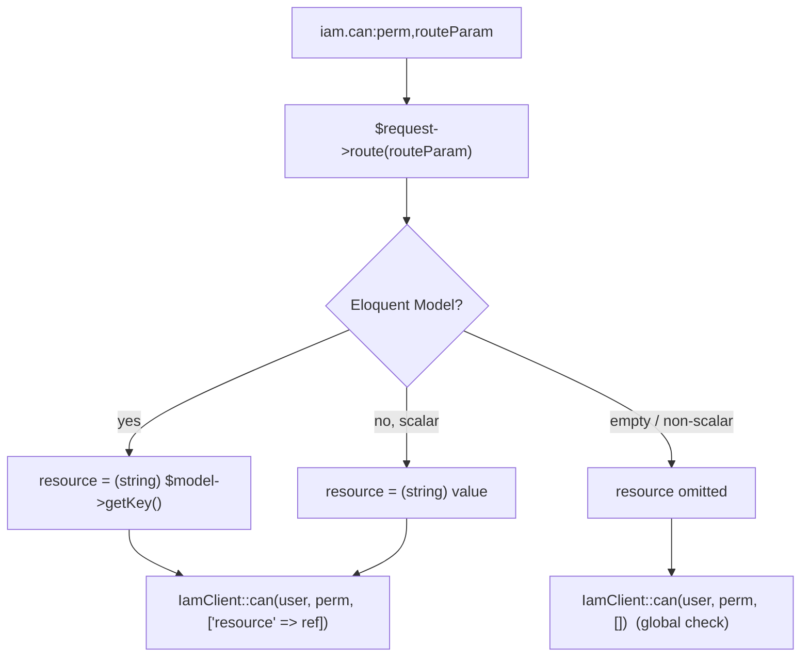

# Protect routes with `iam.can`

## Motivation

You want a route guarded by central policy — *"only subjects the PDP permits may update this invoice"* —
without writing the rule into your app. `iam.can` is a drop-in replacement for Spatie's `permission:`
middleware whose answer comes from IAM, and `iam.auth` is a fail-closed guard that a subject exists at all.

## `iam.auth` — require a resolvable subject

```php
Route::middleware(['auth', 'iam.auth'])->group(function () {
    // every route here is guaranteed to have a subject IAM can reason about
});
```

`iam.auth` does **not** replace Laravel's `auth` guard — it assumes it. If `$request->user()` is `null`, it
aborts with **401**. Put it after `auth` to fail closed even if the guard chain is misconfigured.

## `iam.can:<permission>[,<routeParam>]`

```php
// Permission only
Route::get('/reports', [ReportController::class, 'index'])
    ->middleware(['auth', 'iam.can:reports:view']);

// Permission bound to a route resource (ReBAC)
Route::put('/invoices/{invoice}', [InvoiceController::class, 'update'])
    ->middleware(['auth', 'iam.can:billing:invoices.update,invoice']);
```

Outcomes:

- **401** when there's no authenticated user.
- **403** when IAM denies — *or* when the permit requires a step-up that isn't satisfied yet.
- **pass** only when [`granted()`](/concepts/granted-vs-allowed) is true.

## How the resource is resolved

The optional second argument names a **route parameter**. The middleware reads `$request->route($param)` and
turns it into a resource reference:



So with route-model binding (`{invoice}` resolves to an `Invoice` model), the decision is scoped to that
invoice's primary key automatically.

::: callout warning "Forgetting the routeParam silently broadens the check"
If a permission is *about a specific thing* but you omit `,routeParam`, the check is evaluated **globally** —
which may grant more than intended (over-authorization). When the permission is per-resource, always bind the
parameter. See [Per-resource (ReBAC) checks](/guides/rebac-resource-checks).
:::

## Worked example

```php
// routes/web.php
Route::middleware('auth')->group(function () {
    Route::get('/projects/{project}', [ProjectController::class, 'show'])
        ->middleware('iam.can:projects:view,project');

    Route::put('/projects/{project}', [ProjectController::class, 'update'])
        ->middleware('iam.can:projects:edit,project');
});
```

```php
// app/Http/Controllers/ProjectController.php
public function update(Request $request, Project $project)
{
    // We already passed iam.can:projects:edit,project — the PDP said this user
    // may edit THIS project. No further role check needed here.
    $project->update($request->validated());

    return back();
}
```

## The alias-collision rule

The provider registers the `iam.can` / `iam.auth` aliases **only if those names aren't already taken**. In a
same-app deployment where the IAM server already defines `iam.can` for its Admin API, the client will not
overwrite it (that would break the Admin API). In that case, reference the client middleware class directly:

```php
use Padosoft\Iam\Client\Http\Middleware\IamCan;

Route::put('/invoices/{invoice}', [InvoiceController::class, 'update'])
    ->middleware(['auth', IamCan::class.':billing:invoices.update,invoice']);
```

## Gotchas

::: callout danger "iam.auth is not authentication"
`iam.auth` only checks that a user is *already* present on the request. It never logs anyone in. Your normal
`auth` middleware (or guard) must run first.
:::

::: callout warning "Order matters"
List `auth` (or your guard) before `iam.auth` / `iam.can`. Without an authenticated user, `iam.can` aborts
401 before it ever asks the PDP.
:::

## See also

- [Use the Gate adapter](/guides/gate-adapter) — the same decisions via `$user->can()`.
- [Middleware & Gate reference](/reference/middleware-and-gate) — exact signatures and status codes.
- [Handle step-up assurance](/guides/step-up) — what the 403-on-step-up means and how to react.
