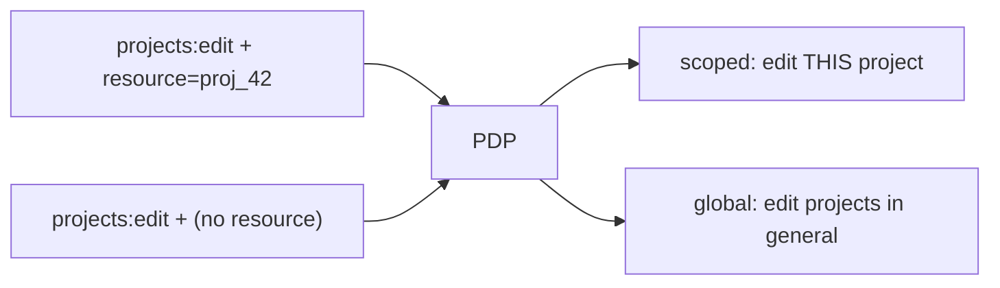

# Per-resource (ReBAC) checks

## Motivation

RBAC answers *"can this user edit projects?"*. ReBAC answers *"can this user edit **this** project?"* — the
decision depends on the relationship between the subject and a specific resource. The client carries a
`resource` reference into the query so the PDP can evaluate relationship-based policy.

## The three ways to bind a resource

| Path | How the resource is set | Notes |
|---|---|---|
| **Middleware** | `iam.can:perm,routeParam` → route value, model `getKey()` extracted | the most automatic |
| **Facade** | `'resource' => '...'` reserved context key | explicit string |
| **Gate adapter** | first **string** argument to `$user->can(perm, 'ref')` | models are *not* auto-keyed |

### Via middleware (recommended for routes)

```php
Route::put('/projects/{project}', [ProjectController::class, 'update'])
    ->middleware('iam.can:projects:edit,project');
```

The middleware reads `$request->route('project')`. With route-model binding it's a `Project` model, and the
middleware uses `(string) $project->getKey()` as the resource. Without binding it uses the raw scalar route
value.

### Via the facade

```php
Iam::can($user, 'projects:edit', ['resource' => (string) $project->getKey()]);
```

The reserved `resource` key is pulled from `$context` and set on the `DecisionRequest`. Everything else in
`$context` remains [ABAC facts](/concepts/context-and-resources).

### Via the Gate adapter

```php
$user->can('projects:edit', (string) $project->getKey());  // string → resource
```

::: callout warning "The Gate path only keys strings"
A bare `$user->can('projects:edit', $project)` passes a **model**, not a string — so no resource is sent and
the check is global. Pass `(string) $project->getKey()`, or enforce at the route with `iam.can:...,project`.
See [Use the Gate adapter](/guides/gate-adapter).
:::

## What "global" means here

When no resource is bound, the `DecisionRequest::$resource` is `null` and the PDP evaluates the permission
**without** a specific resource — effectively *"can this user edit projects in general"*. For a per-resource
permission that's usually broader than intended.



## Worked example — authorize before mutating

```php
public function update(Request $request, Project $project)
{
    $decision = Iam::check($request->user(), 'projects:edit', [
        'resource' => (string) $project->getKey(),
    ]);

    abort_unless($decision->granted(), 403);

    $project->update($request->validated());

    return back();
}
```

Or, equivalently and more concisely, let the middleware do it:

```php
Route::put('/projects/{project}', [ProjectController::class, 'update'])
    ->middleware('iam.can:projects:edit,project');
```

## Resource references are strings

The client serializes a resource to a **string**. For an Eloquent model that's `(string) $model->getKey()`;
for a raw route value it's the value cast to string. Make sure your PDP policy expects the same reference
format your app emits (e.g. a numeric id vs a slug). The reference is part of the
[cache key](/guides/cache-decisions), so two different references never share a cached decision.

## Gotchas

::: callout danger "Empty or non-scalar keys are dropped"
If a model's key is non-scalar, or a route value is empty, the middleware sends **no** resource — and the
check silently becomes global. Ensure bound resources have a scalar, non-empty key.
:::

## See also

- [Protect routes with iam.can](/guides/protect-routes)
- [ABAC context & ReBAC resources](/concepts/context-and-resources)
- [The decision contract](/concepts/decision-contract)
