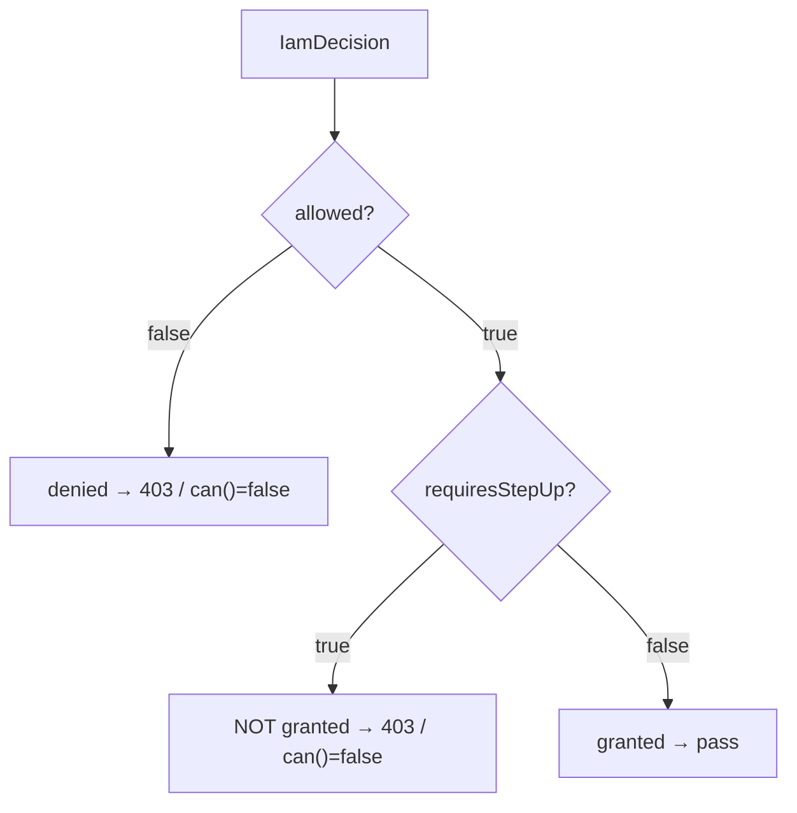

# Handle step-up assurance

## Motivation

Some actions are permitted only at a higher **assurance level** (AAL) — for example, deleting an invoice
might require a freshly re-authenticated session. The PDP can answer *"permitted, but step up first"*. This
client makes that the **safe default**: such a permit does not pass a gate until the step-up is satisfied.

## The two fields

An [`IamDecision`](/concepts/decision-contract) carries:

- **`allowed`** — the raw PDP verdict (the policy *would* permit).
- **`requiresStepUp`** — `true` when that permit is conditional on a higher AAL.
- **`requiredAal`** — the level the subject must reach (e.g. `aal2`), when provided.

And the derived guard:

$$
\text{granted} \;=\; \text{allowed} \;\wedge\; \lnot\,\text{requiresStepUp}
$$

`Iam::can()`, the `iam.can` middleware, and the Gate adapter all gate on `granted()` — so a low-AAL session
is never let through on an `allowed`-but-step-up permit.

## What you see by default



So out of the box, an action requiring step-up is simply blocked (403 via middleware, `false` via the
facade/Gate). That's correct and safe — but if you want to *offer* the step-up, use `check()`.

## Driving a step-up flow

Use `Iam::check()` and branch on the decision instead of letting middleware hard-deny:

```php
use Padosoft\Iam\Client\Facades\Iam;

public function destroy(Request $request, Invoice $invoice)
{
    $decision = Iam::check($request->user(), 'billing:invoices.delete', [
        'resource' => (string) $invoice->getKey(),
        'aal'      => session('current_aal', 'aal1'),  // tell the PDP the current level
    ]);

    if ($decision->requiresStepUp) {
        // Permitted in principle — send the user to re-authenticate at a higher AAL.
        return redirect()
            ->route('auth.step-up', ['required' => $decision->requiredAal, 'return' => url()->current()]);
    }

    abort_unless($decision->granted(), 403);

    $invoice->delete();

    return back();
}
```

::: callout tip "Pass the current AAL" icon:key-round
The reserved `aal` context key sets `DecisionRequest::$currentAal` (default `aal1`). After a successful
step-up, record the new level (e.g. in the session) and pass it on subsequent checks so the PDP sees the
satisfied assurance.
:::

## Where step-up is enforced for you

| Surface | Behavior on `requiresStepUp = true` |
|---|---|
| `iam.can` middleware | **403** — `granted()` is false |
| Gate adapter (`$user->can`, `@can`, `authorize`) | **false** — `granted()` is false |
| `Iam::can()` / `Iam::denies()` | `false` / `true` |
| `Iam::check()` | returns the decision with `requiresStepUp = true` — **you** decide what to do |

So routes and Blade stay safe automatically; you only opt into a re-auth UX where you call `check()`.

## Gotchas

::: callout danger "Never branch on allowed to bypass step-up"
`if ($decision->allowed) { /* proceed */ }` ignores the step-up requirement and reintroduces the exact hole
this design closes. Gate on `granted()`; treat `requiresStepUp` as a *prompt to re-authenticate*, not a
condition to skip.
:::

::: callout warning "Step-up decisions aren't special-cased in the cache"
A decision is cached by its inputs — including `currentAal`. A check at `aal1` and the same check at `aal2`
have different cache keys, so raising the AAL produces a fresh decision rather than a stale cached one. See
[Cache decisions](/guides/cache-decisions).
:::

## See also

- [granted() vs allowed](/concepts/granted-vs-allowed)
- [Ask IAM with the facade](/guides/facade-checks)
- [The decision contract](/concepts/decision-contract)
