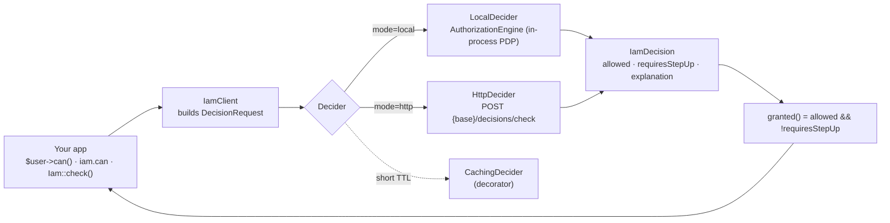

# laravel-iam-client

> **`padosoft/laravel-iam-client` lets a Laravel app ask one question — *"can this subject do this permission on this resource?"* — and get a binding answer from a central Policy Decision Point (PDP), through the authorization tools your app already speaks: middleware, `Gate`, `$user->can()`, `@can` and `authorize()`.**
> It is **fail-closed by design**: every transport denies on any error, and a permit that still needs a step-up is treated as *not yet granted*.

::: callout info "New here? Read this page top to bottom" icon:compass
In a few minutes you'll know what this package is, the problem it solves, how a decision flows from
`$user->can()` to the PDP and back, and where to click next. Every other page goes deeper — this one gives
you the whole picture.
:::

---

## What it is — in one minute

Centralizing authorization in one PDP is the right call: one place for **RBAC + ABAC + ReBAC**, step-up
assurance, tenant isolation and tamper-evident audit. But if every consuming app has to learn a new SDK and
sprinkle bespoke calls everywhere, adoption dies. Your apps already know Laravel authorization.

`laravel-iam-client` is the **bridge**. You point it at your IAM server and authorization flows through the
tools your app already uses:

```php
Route::put('/invoices/{invoice}', [InvoiceController::class, 'update'])
    ->middleware('iam.can:billing:invoices.update,invoice');   // ← decided by the central PDP
```

It runs in two modes with **identical application code**:

- **`local`** — the IAM server lives in the same app; the client calls the PDP in-process (zero network).
- **`http`** — the server is remote; the client `POST`s to its Admin API.

Swap a single env var to move from a modular monolith to distributed services. The controllers don't change.

> **In one line:** *the shortest path from "every app reinvents permission checks" to "one PDP decides, and
> your `$user->can()` just works".*

---

## The problem it solves

| Without laravel-iam-client | With laravel-iam-client |
|---|---|
| Each app grows its own roles table and its own copy of "who is an admin". | Apps ask one central PDP; the rule lives in IAM, not in your controllers. |
| Moving from a monolith to services means rewriting every auth check. | Flip `mode=local` → `mode=http`; the route and controller code are unchanged. |
| A bug in an auth check quietly *allows* an action. | **Fail-closed**: any transport error, non-2xx, unparseable body or engine exception resolves to **deny**. |
| A "permitted, but only at a higher assurance level" answer is easy to mishandle. | `granted()` folds step-up in: a permit needing a higher AAL is *not yet granted*. |
| Per-resource ("can edit *this* project") checks need bespoke plumbing. | `iam.can:projects:edit,project` binds the decision to the route-bound model — ReBAC for free. |

---

## Who it's for

::: grids
  ::: grid
    ::: card "App developers" icon:code
    You want central policy without learning a new vocabulary. Keep `@can`, `$user->can()`, policies and
    `authorize()` — the answer just comes from the PDP.
    :::
  :::
  ::: grid
    ::: card "Platform teams" icon:server
    You run several Laravel apps against one IAM server and want the same client whether the PDP is
    in-process or across the network.
    :::
  :::
  ::: grid
    ::: card "Teams migrating off spatie/permission" icon:replace
    `iam.can:` is a drop-in for Spatie's `permission:` middleware. Centralize the rule, keep the route shape.
    :::
  :::
  ::: grid
    ::: card "Security-minded operators" icon:shield
    You need the safe default to be the *only* default: no fail-open switch, step-up honored, decisions
    cached only as long as you allow.
    :::
  :::
:::

---

## How a decision flows



Every path that ends in an error — an unreachable PDP, a non-2xx response, an unparseable body, an engine
exception, or no resolvable subject — produces a **deny**, never an allow.

---

## Start in 60 seconds

::: steps
1. **Install and publish the config**
   ```bash
   composer require padosoft/laravel-iam-client
   php artisan vendor:publish --tag=laravel-iam-client-config
   ```
   The service provider wires the right decider (with caching), registers the `iam.can` / `iam.auth`
   middleware aliases and the Gate adapter — automatically.

2. **Point it at the server**
   ```dotenv
   IAM_CLIENT_MODE=http
   IAM_CLIENT_BASE_URL=https://iam.example.com/api/iam/v1
   IAM_CLIENT_TOKEN=your-service-bearer-token
   IAM_CLIENT_APP=billing
   IAM_CLIENT_ORG=org_acme
   ```

3. **Protect a route**
   ```php
   Route::put('/invoices/{invoice}', [InvoiceController::class, 'update'])
       ->middleware(['auth', 'iam.can:billing:invoices.update,invoice']);
   ```
   `iam.auth` 401s without a subject; `iam.can` 403s when IAM denies or a step-up is still required.
:::

**[→ Quickstart](/quickstart)** · **[→ Installation](/installation)** · **[→ Core concepts](/core-concepts)**

---

## Ecosystem

`laravel-iam-client` is the **consumer SDK** of the Laravel IAM family. The related packages:

| Package | Role |
|---|---|
| [laravel-iam-contracts](https://doc.laravel-iam-contracts.padosoft.com) | Shared interfaces & DTOs (PDP, KeyProvider, Assurance, FeatureScope) — the dependency root |
| [laravel-iam-server](https://doc.laravel-iam-server.padosoft.com) | The IAM server: identity, Application Registry + manifests, PDP (RBAC+ABAC+ReBAC), OAuth/OIDC, audit, governance, Admin API & panel |
| **laravel-iam-client** *(this repo)* | Consumer SDK: fail-closed deciders, `IamClient::can()`, the `Iam` facade, a Gate adapter, `iam.auth`/`iam.can` middleware, decision cache |
| [laravel-iam-ai](https://doc.laravel-iam-ai.padosoft.com) | Optional AI module: advisory-only governance (redaction + hallucination guard + audit) |
| [laravel-iam-directory](https://doc.laravel-iam-directory.padosoft.com) | Optional directory module: LDAP / Active Directory (LdapRecord) |
| [laravel-iam-bridge-spatie-permission](https://doc.laravel-iam-bridge-spatie-permission.padosoft.com) | Migration bridge from spatie/laravel-permission: scan, shadow mode, cutover, rollback |
| [laravel-iam-node](https://doc.laravel-iam-node.padosoft.com) | Node/TS client SDK — thin + fail-closed |
| [laravel-iam-react-native](https://doc.laravel-iam-react-native.padosoft.com) | React Native client SDK — thin + hooks |
| [laravel-iam-rust](https://doc.laravel-iam-rust.padosoft.com) | Rust client SDK — async + blocking, fail-closed |

::: callout tip "Package facts" icon:info
Composer `padosoft/laravel-iam-client` · PHP `^8.3` · Laravel 11/12 · depends on
`padosoft/laravel-iam-contracts` · transport via `guzzlehttp/guzzle` · MIT ·
[GitHub](https://github.com/padosoft/laravel-iam-client) ·
[Packagist](https://packagist.org/packages/padosoft/laravel-iam-client)
:::
