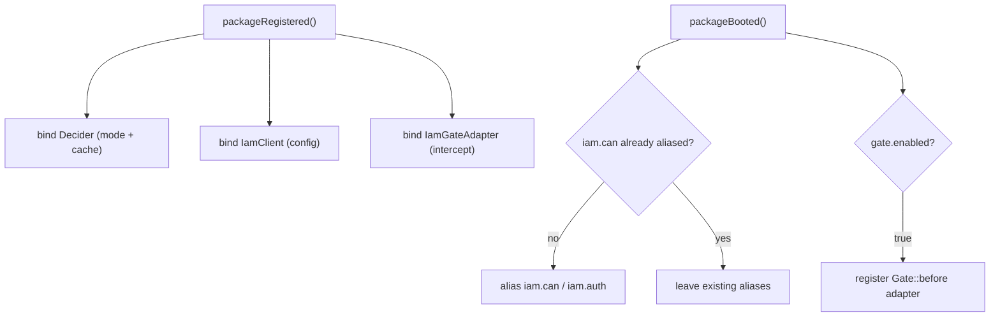

# Installation

## Requirements

| Requirement | Version | Notes |
|---|---|---|
| PHP | **8.3+** | `^8.3` in `composer.json` |
| Laravel | **11 / 12+** | uses `spatie/laravel-package-tools` for registration |
| [`padosoft/laravel-iam-contracts`](https://doc.laravel-iam-contracts.padosoft.com) | `^1.0` | provides `AuthorizationEngine` (the `local` PDP seam) and shared DTOs |
| `guzzlehttp/guzzle` | `^7.0` | HTTP transport for `mode=http` |

For `mode=local` you also need the IAM server installed in the **same** app, so that an
`AuthorizationEngine` implementation is bound in the container — typically
[`padosoft/laravel-iam-server`](https://doc.laravel-iam-server.padosoft.com).

## Install

```bash
composer require padosoft/laravel-iam-client
```

The package is auto-discovered: the `extra.laravel.providers` entry registers
`Padosoft\Iam\Client\IamClientServiceProvider` for you.

## Publish the config

```bash
php artisan vendor:publish --tag=laravel-iam-client-config
```

This writes `config/iam-client.php`. Every key is overridable by environment variable where it makes sense —
see [Configuration](/operations/configuration) for the full table.

## What the service provider does

On `packageRegistered()` it binds three singletons:

::: steps
1. **`Decider`**
   Chosen from `iam-client.mode`: `http` → `HttpDecider` (a Guzzle client with `http.timeout`, the
   `http.base_url` and `http.token`), otherwise `local` → `LocalDecider` (wrapping the container's
   `AuthorizationEngine`). If `cache.enabled` is `true`, the chosen decider is wrapped in a
   `CachingDecider`. See [Transports](/architecture/transports).
2. **`IamClient`**
   The application-facing API, constructed with the `Decider` and the `iam-client` config array (so it knows
   `subject_type`, `default_application`, `default_organization`).
3. **`IamGateAdapter`**
   Constructed with the `IamClient` and `gate.intercept` (default `namespaced`).
:::

On `packageBooted()` it:

- aliases `iam.can` → `IamCan` and `iam.auth` → `IamAuthenticate` — **only if those aliases don't already
  exist**. (In a same-app deployment where the server already defines `iam.can` for its Admin API, the
  client does not overwrite it. You can still reference the middleware class explicitly.)
- registers the Gate adapter on Laravel's `Gate` when `gate.enabled` is `true`.



::: callout tip "Nothing else to register"
You don't manually bind anything or add the facade alias — the provider handles it. The `Iam` facade resolves
`IamClient` from the container.
:::

## Next

- [Quickstart](/quickstart) — protect your first route.
- [Configuration](/operations/configuration) — every key and env var.
- [Deployment topologies](/operations/deployment-topologies) — local vs http, and where caching helps.
