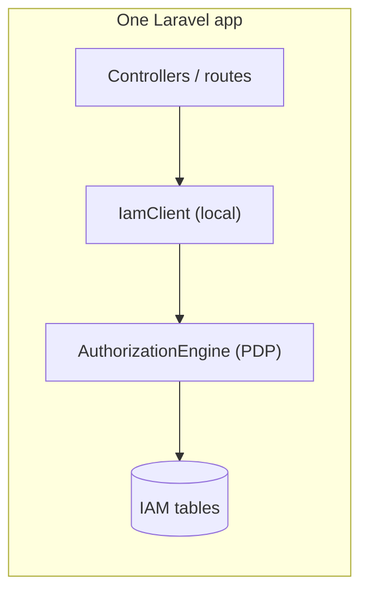
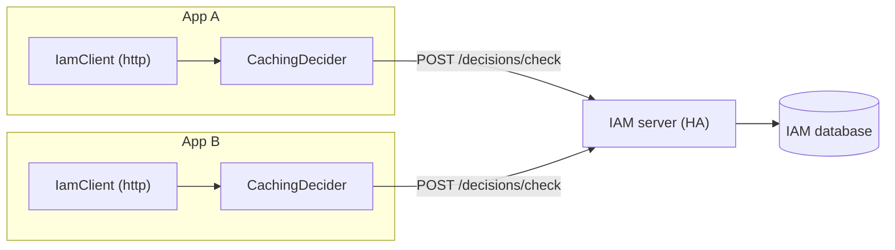

# Deployment topologies

The client supports two topologies with the same application code. This page helps you pick one and operate
it.

## Topology A — same-app (modular monolith)

The IAM server and the consuming app run in one Laravel application. The client uses `mode=local` and calls
the PDP in-process.



- **Pros:** no network on the auth path, lowest latency, simplest failure surface.
- **Cons:** the app and the server scale and deploy together.
- **Notes:** caching adds little (the engine call is already cheap); you may set `cache.enabled = false`. In
  this topology the server's own `iam.can` alias exists, so use the explicit
  [`IamCan::class`](/best-practices/coexistence) form on app routes when you mean the client's middleware.

## Topology B — distributed (services)

The IAM server is its own service; one or more apps consume it over HTTP with `mode=http`.



- **Pros:** one PDP for many apps; independent scaling and deployment.
- **Cons:** a network hop per uncached decision; the server's availability gates every app.
- **Notes:** caching matters here — keep `cache.enabled = true` and tune `cache.ttl`. Run the server **HA**;
  because the client is [fail-closed](/concepts/fail-closed), a server outage denies actions.

## Choosing

| If… | Use |
|---|---|
| the server can live in the app and you want minimal latency | **local** (Topology A) |
| several apps share one PDP, or you need independent scaling | **http** (Topology B) |
| you're starting as a monolith but expect to split later | **local now**, flip to **http** when you extract |

## Multi-node caching

In Topology B with several app instances, decide whether decision caching should be **per-node** or
**shared**:

| `cache.store` | Behavior |
|---|---|
| `null` / a local driver (array, file, apcu) | each instance caches independently — simplest, but staleness is per-node |
| a shared driver (redis, memcached) | consistent decision cache across the fleet; one revocation window for all nodes |

For predictable revocation latency across instances, point `cache.store` at a shared store.

## The migration path (A → B)

::: steps
1. **Run as a monolith** with `IAM_CLIENT_MODE=local`. Ship features; don't think about the network.
2. **Extract the server** into its own deployment and mint a service token for each app.
3. **Flip the env** on each app:
   ```diff
   - IAM_CLIENT_MODE=local
   + IAM_CLIENT_MODE=http
   + IAM_CLIENT_BASE_URL=https://iam.internal/api/iam/v1
   + IAM_CLIENT_TOKEN=${IAM_SERVICE_TOKEN}
   ```
4. **Clear config cache** and deploy. No controller, route, Gate or facade change is required — that's the
   payoff of the [Decider seam](/architecture/transports).
:::

## Operational checklist

::: steps
1. **Server HA** sized for peak decision QPS (Topology B).
2. **Timeout** (`http.timeout`) set from your latency budget.
3. **Cache TTL** set from your revocation budget; **shared store** for multi-node.
4. **Service token** rotation plan for `IAM_CLIENT_TOKEN`.
5. **Mode + alias** sanity: in same-app, confirm whether `iam.can` resolves to the client or the server.
:::

## See also

- [Choose a transport](/guides/choose-transport)
- [Cache decisions](/guides/cache-decisions)
- [Fail-closed by design](/best-practices/fail-closed-design)
