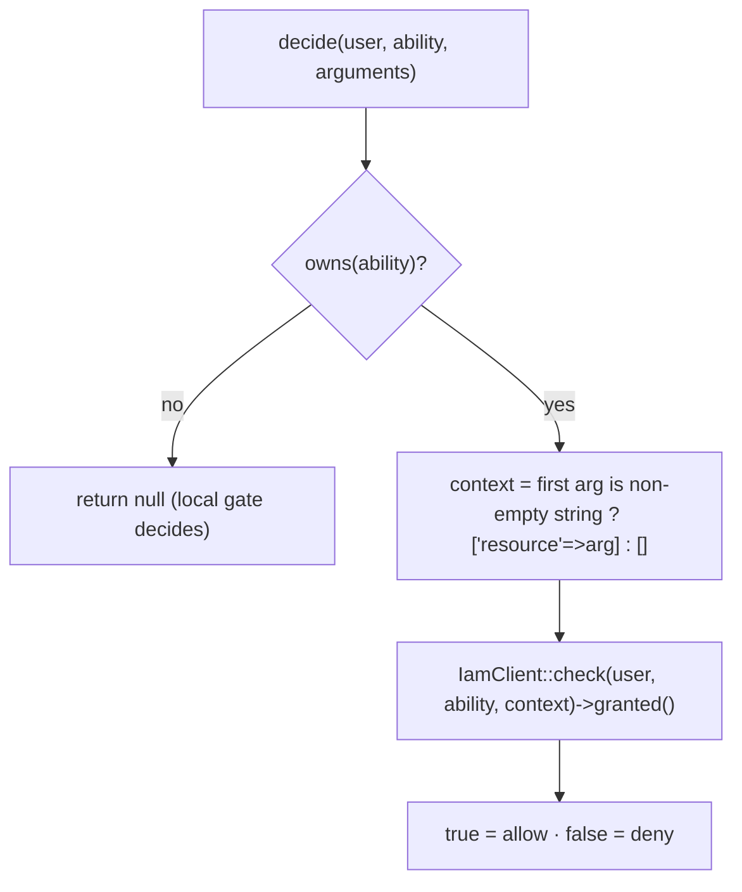

# Middleware & Gate

## `iam.auth` — `IamAuthenticate`

| | |
|---|---|
| Alias | `iam.auth` (registered if free) |
| Class | `Padosoft\Iam\Client\Http\Middleware\IamAuthenticate` |
| Signature | `handle(Request $request, Closure $next): Response` |
| Behavior | aborts **401** when `$request->user()` is `null`; otherwise passes through |

```php
Route::middleware(['auth', 'iam.auth'])->group(function () {
    // guaranteed to have a resolvable subject
});
```

It assumes Laravel's `auth` ran first — it does not authenticate, only asserts a user is present (fail-closed).

## `iam.can` — `IamCan`

| | |
|---|---|
| Alias | `iam.can` (registered if free) |
| Class | `Padosoft\Iam\Client\Http\Middleware\IamCan` |
| Signature | `handle(Request $request, Closure $next, string $permission, ?string $resourceParam = null): Response` |

### Arguments

| Position | Name | Meaning |
|---|---|---|
| 1 | `$permission` | the ability, e.g. `billing:invoices.update` |
| 2 (optional) | `$resourceParam` | name of a route parameter to bind as the decision `resource` |

### Outcomes

| Condition | Result |
|---|---|
| no authenticated user | **401** "Unauthenticated." |
| `IamClient::can(...)` is false (deny, or step-up unsatisfied) | **403** "This action is unauthorized." |
| otherwise | pass to `$next` |

### Resource resolution

When `$resourceParam` is given, the middleware reads `$request->route($resourceParam)` and builds a reference:

| Route value | Reference used |
|---|---|
| Eloquent `Model` | `(string) $model->getKey()` (if scalar) |
| scalar (string/int) | `(string) value` (if non-empty) |
| anything else / empty | none → the check is **global** |

```php
->middleware('iam.can:projects:edit,project');   // resource = bound {project}'s key
->middleware('iam.can:reports:view');             // no resource (global)
```

### Explicit class form

When the `iam.can` alias is already taken (same-app deployment with the server), reference the class:

```php
use Padosoft\Iam\Client\Http\Middleware\IamCan;

->middleware(IamCan::class.':billing:invoices.update,invoice');
```

## Gate adapter — `IamGateAdapter`

| | |
|---|---|
| Class | `Padosoft\Iam\Client\Gate\IamGateAdapter` |
| Registered | automatically when `gate.enabled = true` |
| Hook | `Gate::before` |
| `decide()` | `(Authenticatable $user, string $ability, array $arguments = []): ?bool` |

### Ownership (`intercept`)

| `intercept` | `owns(ability)` is true when |
|---|---|
| `namespaced` *(default)* | the ability contains `:` |
| `all` | always |

`decide()` returns `null` when the adapter doesn't own the ability (Laravel's local Gates/policies then
decide), otherwise `IamClient::check($user, $ability, $context)->granted()`.

### Resource from gate arguments

The first element of `$arguments` is used as the `resource` **only if it is a non-empty string**:

```php
$user->can('warehouse:stock.adjust', 'wh_milan');             // resource = 'wh_milan'
$user->can('billing:invoices.update', $invoice);              // model → NO resource (global)
$user->can('billing:invoices.update', (string) $invoice->id); // resource = id
```



## Status-code summary

| Surface | Deny signal | Step-up-unsatisfied signal |
|---|---|---|
| `iam.auth` | 401 (no user) | — |
| `iam.can` | 403 | 403 (folded into `granted()`) |
| Gate adapter | `false` (short-circuits gate) | `false` |
| `Iam::can()` | `false` | `false` |

## See also

- [Protect routes with iam.can](/guides/protect-routes)
- [Use the Gate adapter](/guides/gate-adapter)
- [PHP API reference](/reference/php-api)
